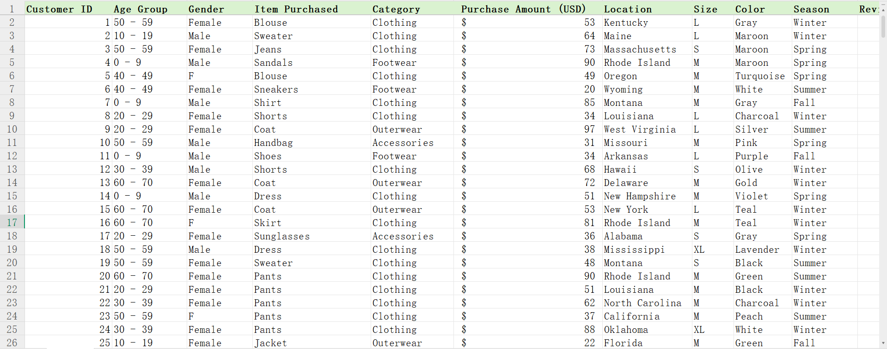
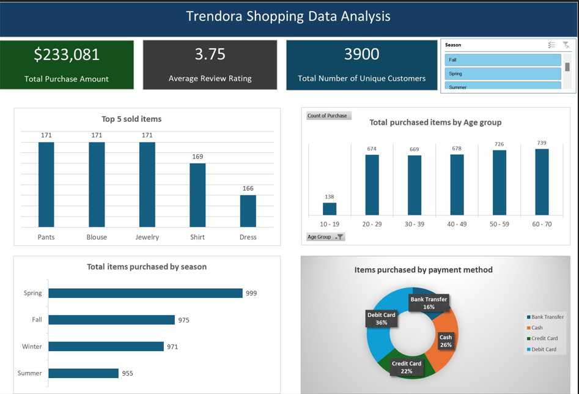

# Sales Performance Analysis for Trendora Shopping

## Business Context
Tendora is a growing fashion brand with both online and in-store customers. Management seeks help in understanding the business performance.

## Objective of the analysis
This analysis transforms raw data into actionable strategies and also equips Trendora with the insights needed to grow smarter, engage customers more effectively, and boost revenue sustainably.

## Data Overview
The dataset includes information on items purchased, purchased amount, payment method, location and season etc.

## Key Findings
- Top purchased items are blouses, Jewelry and Pants.
- The top purchasing states include Montana, California, Idaho, Illinois and Alabama.
- Debit Cards and Cash dominate payment methods, while Bank Transfers are least used.
- Fall generated the highest revenue.

## Dashboard

## Business Implications
Prioritize inventory and promotions on best-selling products. Launch geo-targeted campaigns in top performing states.

## Recommendations
- Focus inventory on bestsellers like blouses and jewelry.
- Target top states with local promotions.
- Plan major campaigns around Fall and Spring.
- Increase visibility of promo offers.

## Conclusion
The analysis of Trendora's shopping data reveals critical insights into customer behavior, top-selling products, regional performance, and seasonal trends. These insights empower Trendora to make data-driven decisions, optimize marketing efforts, and enhance customer satisfaction and loyalty.

## Tools Used
Microsoft Excel
